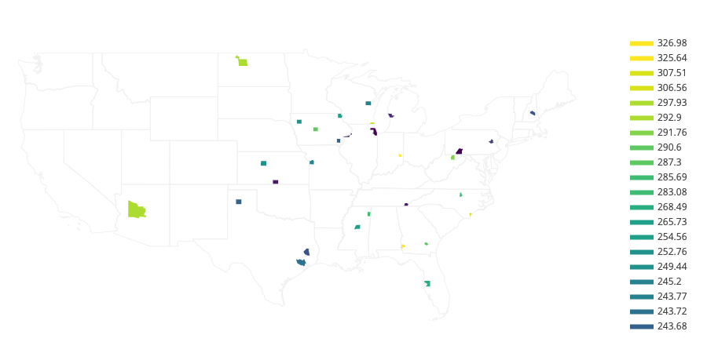

# health-plan-stats

## Quick Start :rocket:
No time to read everything below? In most cases, you'll be able to run this code with these steps:

1. Clone the git repository 
    ```
    git clone https://github.com/sleibman/health-plan-stats.git
    ```
2. Install dependencies
    ```
    cd health-plan-stats
    pip install -r requirements.txt
    ```
3. Run the code and observe results on stdout (discarding stderr in this example)
    ```
    ./process_plan_rates.py 2> /dev/null
    ```

Read on for more details...

## Table of Contents
* [Quick Start](#quick-start-rocket)
* [Overview](#overview)
* [Setting Up Your Environment](#setting-up-your-environment)
* [Running the Code](#running-the-code)
* [Testing](#testing)
* [Next Steps](#next-steps)
  * [Platforms](#platforms)
  * [Configurability](#configurability)
  * [Documentation](#documentation)
  * [Packaging](#packaging)
  * [Containerization](#containerization)
  * [Deployment](#deployment)
  * [Extending Functionality](#extending-functionality)
  * [Performance](#performance)
* [Just for fun - plotting the data](#just-for-fun---plotting-the-data)
* [Questions?](#questions) 

## Overview
This is an implementation of the "Second Lowest Cost Silver Plan" assignment described in the 
[homework.adhoc.team assignments](https://homework.adhoc.team/slcsp/). 

It is a sample problem in which the goal is to identify the second lowest cost silver plan (SLCSP) for a group of ZIP
codes. The SLCSP is important to our hypothetical users because – in a benchmarking strategy not unlike my algorithm dictating the 
choice of the second cheapest glass of wine in a fancy restaurant – it represents the benchmark health plan in a
particular area. This is used to compute the corresponding tax credit for qualifying individuals and families.


### Setting Up Your Environment
This code uses Python 3, and Python 2 will not work. Confirm that you have `python3` as an executable in your shell
search path, or that `python -V` shows a 3.x version.

If your python environment doesn't already have all the necessary packages, you'll see an error like the following:
```
ModuleNotFoundError: No module named 'numpy'
```
In this case, install the prerequisites via `pip`. It is recommended that you use a python virtualenv in order to avoid
polluting your existing python environment. Example:
```
mkdir ~/venvs
(cd ~/venvs && python3 -m venv slcsp)
source ~/venvs/slcsp/bin/activate 
pip install -r requirements.txt
``` 

Note: In a more complete partner deliverable, I would package the environment using a tool like Docker (see 'Next Steps'), but
for the case of an interviewer quickly evaluating a code submission, it seems like a safer bet to not assume an existing
installation of the Docker tool suite.


## Running the code
As per the assignment specification, the code expects three input csv files controlling the behavior of a given run, and
supplies results on stdout. The inputs are:
* `slcsp.csv` — A two column csv. The first column contains the zip codes for which results are requested. The 
  second column is ignored, allowing the file to act as a template for output in which the second column contains 
  results.
* `plans.csv` — all the health plans in the U.S. on the marketplace
* `zips.csv` — a mapping of ZIP code to county/counties & rate area(s)

The simplest method to execute the code is to run `./process_plan_rates.py` with the above three files stored in the 
'sample_data' directory immediately below the current working directory.

Log messages are written to stderr.
Since the specified behavior mandates that the results be sent to stdout, it may be helpful to disentangle those two
streams by redirecting stderr to a file.
Example:
```
./process_plan_rates.py 2> slcsp.log
```


## Testing
```
cd <top_level>
pytest
```

This code uses pytest for unit tests (as opposed to unittest, nose tests, or other common options). pytest has the minor
drawback that it does not come built in with a typical python distribution, but the advantage that test files have less
boilerplate code than unittest and a variety of test execution conveniences.


## Next Steps
The guidelines for the project stated that effort should be limited to three hours.
If more time were to be allocated to the challenge, the following would be worth addressing:

### Platforms
This was built on Mac OSX, tested on Mac OSX and Linux. 
Please please please let me know if you're trying this on Windows and get stuck.
Windows testing would be a future task, given a longer window of time.

### Configurability
Add command line options to override file locations/names.

### Documentation
Something with better formatting than this README would be nice if the application were even slightly more complicated
than it is. The appropriate documentation format should be chosen in collaboration with the partner, to ensure that we're
giving them something familiar that they can maintain, because outdated documentation loses its value quicker than sushi
on a hot car dashboard in summer. In the absence of any other expressed preference, for a small python project like this,
I'd default to static web pages built from Sphinx docs. 

### Packaging
A fairly clean way of getting this to users accustomed to running python code would be to 
wrap it up as a pip installable package, and potentially also publish it on a PyPi server.

### Containerization
For anything with dependencies even slightly more complicated than this sample code, it would be worth the effort to 
define a Docker image (or similar container) with this code and any required supporting environment. This could be in
addition to, or instead of making it pip installable, again depending on expected usage. Encapsulating the system within
a Docker container is a nice way of enabling a flexible variety of deployment strategies.

### Deployment
In a real world scenario, we should expect that it's likely that this logic will need to be executed on a regular basis,
with updated inputs, and that the outputs would in turn be provided to a consumer of the data that would put the results
to use. Appropriate deployment strategies would depend on the tools available to our partner and the expected usage.
Some examples could be:
* Simply allow manual invocation, or
* Trigger an invocation of the code whenever the inputs are updated. This might be done through a cron job, or by having
  a dedicated S3 bucket for inputs and an AWS Glue or Lambda job triggered by the presence of a new file, or
* Include the code as a step orchestrated by a workflow manager such as Apache Airflow.
I stopped short of implementing any of these deployment examples because the right answer really depends on feedback
from a partner. It could be that none of the above are appropriate because what they really want is to package this
functionality as a web service, or something else that merits more discussion.

### Extending functionality
Identification of the "second lowest cost silver plan" is certainly not the only analysis that could be done with the
input data. This one output was the stated goal, and as it is explicitly a toy sample problem, the code has been written
in a way that avoids being overly generalized when doing so would interfere with simplicity or readability. 
Nevertheless, good design is characterized by extensibility, and the code has been organized in a way that should make
it easy to add new outputs derived from some other function of the input data.

### Performance
With the sample data set provided, performance is not an issue, and the entire script takes about a second to run to 
completion:
```
% time ./process_plan_rates.py > /dev/null 2>&1
./process_plan_rates.py > /dev/null 2>&1  1.22s user 0.17s system 194% cpu 0.711 total
```
The code works by loading all data into memory, which would start to become an issue if there were three orders of
magnitude more input data (two-ish gigabytes, instead of the current 2 megabytes). The statistics for each zip code are
independent from each other, so it would be possible to stream the list currently represented by the slcsp.csv file. 

By inserting timers into the code, I can see that (on 2.6 GHz 6-Core Intel Core i7 mac laptop) the work to produce a
a result for each zip code takes about 8 milliseconds. That's the run time for the slcsp.py:slcsp() function, which
relies on data already being loaded into pandas DataFrames in memory.

Unlike the ZIP code list in the slcsp file, it's necessary to do the equivalent of a relational join on the data inside
the plans.csv and zips.csv files, so streaming the data from those is not practical, though there would still be the
opportunity to logically shard on something like the US State field in the data. In any case, the number of counties and
associated health plans in the US is far too small for data size to be a concern in this way. The more likely 
performance challenge would come when more complicated analysis is desired, and would be handled by considering the
algorithmic approach to that particular task.

## Just for fun - plotting the data

Purely for the fun of it, I plotted the SLCSP data for each county specified in the sample slcsp.csv file.
The results:


Achieved by including the FIPS county code in a results_df DataFrame and running:
```
import plotly.figure_factory as ff
r = result_df.dropna()  # Drop rows with no defined SLSCP value
fig = ff.create_choropleth(fips=r.fips, values=r.rate)
fig.layout.template = None
fig.show()
```
Note: Installation and configuration of plotly and plotly.figure_factory are beyond the scope of this README file.

## Questions?

Please contact me (Steve Leibman <sleibman@gmail.com>) if you're curious about any of this. 